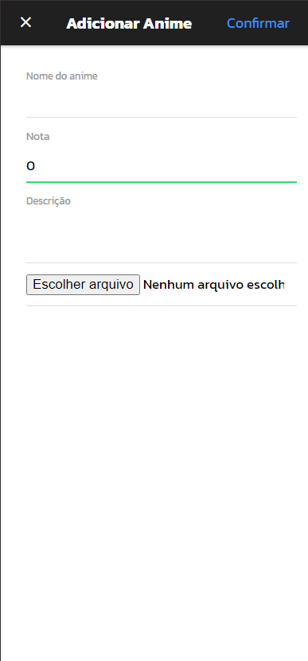
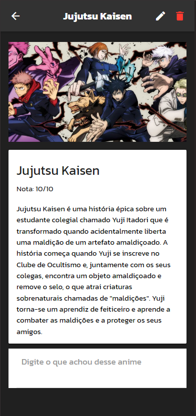
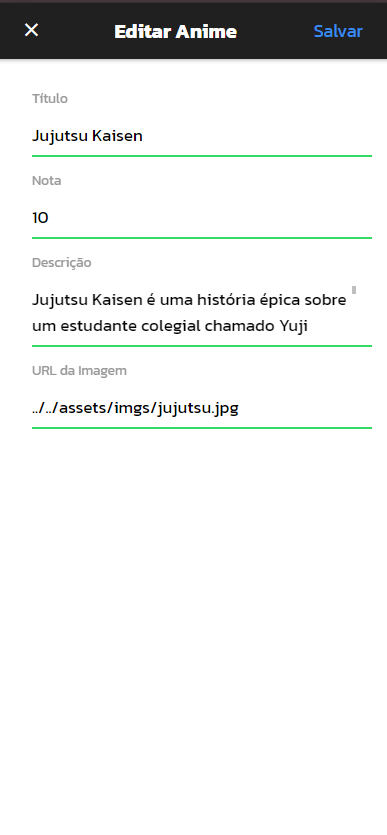
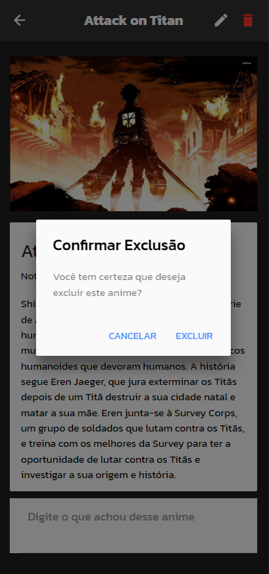
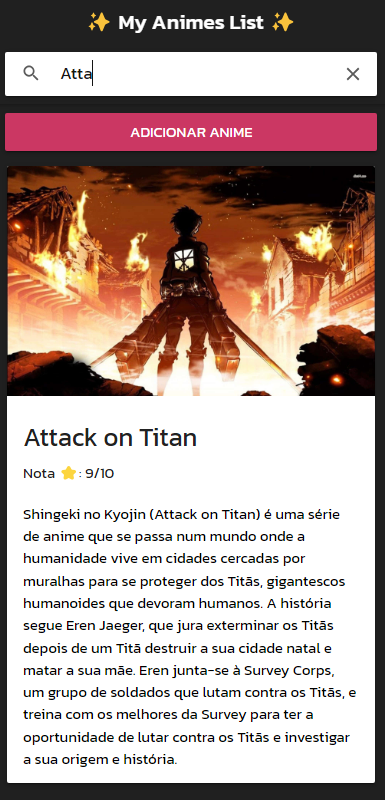

# 📱 MY ANIMES LIST


 
 
 
 


**📝 Descrição:**  
Este aplicativo é uma ferramenta prática para fãs de animes gerenciarem suas coleções pessoais. Nele, você pode adicionar novos animes à sua lista, editar detalhes como nome e descrição, ou removê-los quando desejar. Além disso, o aplicativo oferece a funcionalidade de filtrar animes por seus títulos, facilitando a localização rápida dos seus favoritos. Também é possível deixar comentários sobre cada anime, permitindo que você registre suas impressões e opiniões diretamente na plataforma.

## 🛠️ Tecnologias Utilizadas

- **🔷 Ionic:** Versão -> 3
- **🅰️ Angular:** Versão -> 5
- **💚 Node:**  Versão -> 10.24.1

## ✨ Funcionalidades

- 🚀 Gerenciamento de animes favoritos
- 🌟 Review particular do usuário e adição de animes e comentários
- 💡 Exclusão e edição dos animes adicionados no aplicativo pelo usuário

 ## 💻Vídeo no Youtube navegando pelo aplicativo -> 🔴 https://youtu.be/qlkBG5An3yI

## 🚀 Instalação e Execução

### 📋 Pré-requisitos

- Node.js 10.24.1
- Ionic CLI 3

### Instalação

1. Clone o repositório:

    ```bash
    git clone git@github.com:Mandysan123/Aplicativo_TRABALHON1.git
    ```

2. Navegue até o diretório do projeto:

    ```bash
    cd Aplicativo_TRABALHON1
    ```

3. Instale as dependências:

    ```bash
    npm install
    ```

### Executando o Aplicativo

1. Inicie o aplicativo Ionic:

    ```bash
    ionic serve
    ```
2. Acesse o aplicativo em seu navegador em [http://localhost:8100](http://localhost:8100).

## 🤝 Contribuindo

Contribuições são sempre bem-vindas! Sinta-se à vontade para abrir um issue ou enviar um pull request.

## 📄 Licença

Este projeto está sob a licença MIT - veja o arquivo [LICENSE](LICENSE) para mais detalhes.

## 📞 Contato

- **Nome:** Amanda Morais Nascimento
- **Email:** amandamorais0202@gmail.com
- **Portifolio:** [Seu Perfil](https://github.com/Mandysan123)
